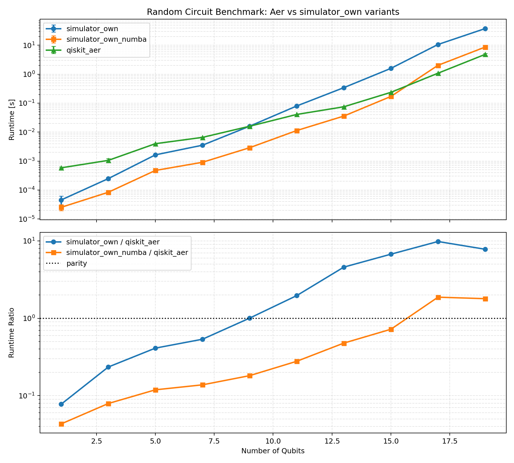

Benchmarking
============

This guide documents the random-circuit benchmark used to compare FP-QGPU
simulator variants against Qiskit Aer for final statevector computation.

Compared Implementations
------------------------

The benchmark compares three implementations:

* ``simulator_own``: baseline implementation using ``u_gate`` and ``cx`` from
   ``fp_qgpu.gatter_operationen``.
* ``simulator_own_numba``: Numba-compiled gate path using ``u_gate_numba`` and
   ``cx_gate_numba`` from ``fp_qgpu.gatter_operationen_numba``.
* ``qiskit_aer``: Aer statevector simulator reference backend.

The Numba ``cx_gate_numba`` implementation uses structured three-loop block
traversal and performs in-place source/target swaps on the flattened statevector,
avoiding a full output-buffer allocation for CX updates.

Benchmark Cases
---------------

The benchmark script is defined in ``testing/benchmark_random_circuit_plot.py``.
It runs for odd qubit counts from 1 to 19:

* ``[1, 3, 5, 7, 9, 11, 13, 15, 17, 19]``

For each case:

* Circuit depth is set to ``max(8, num_qubits * 3)``.
* A random circuit is generated with ``seed=1234 + num_qubits``.
* Aer is configured with ``method='statevector'``, ``fusion_enable=False``, and
   ``max_parallel_threads=1``.
* Warmup runs are executed before measurement for all three implementations.
* Repeats are ``7`` up to 15 qubits and ``3`` for 17 and 19 qubits.

Run the Benchmark
-----------------

From the repository root:

.. code-block:: bash

   uv run python testing/benchmark_random_circuit_plot.py

Latest Result Snapshot (March 2026)
-----------------------------------

Command used:

.. code-block:: bash

   uv run python testing/benchmark_random_circuit_plot.py

The following table shows mean runtimes from the latest run:

.. csv-table:: Runtime comparison across all methods
   :header: "Qubits", "simulator_own [s]", "simulator_own_numba [s]", "qiskit_aer [s]"

   "1", "0.000045", "0.000025", "0.000584"
   "3", "0.000247", "0.000083", "0.001055"
   "5", "0.001637", "0.000474", "0.003981"
   "7", "0.003526", "0.000908", "0.006579"
   "9", "0.015996", "0.002889", "0.015942"
   "11", "0.079914", "0.011322", "0.040746"
   "13", "0.343373", "0.035796", "0.074977"
   "15", "1.593972", "0.170780", "0.236850"
   "17", "10.659633", "2.033439", "1.085665"
   "19", "37.772269", "8.676032", "4.843565"

Generated Plot
--------------

Generate the plot with:

.. code-block:: bash

   uv run python testing/benchmark_random_circuit_plot.py

Generated asset:

* ``testing/.benchmarks/random_circuit_benchmark.png``

The docs use a reusable benchmark asset:

* ``docs/_static/random_circuite_benchmark.png``

The figure contains two subplots:

* Runtime over qubits (custom simulator vs Aer)
* Ratio over qubits (``variant/aer``) with a reference line at ``1.0``

The generated plot included in the docs:

