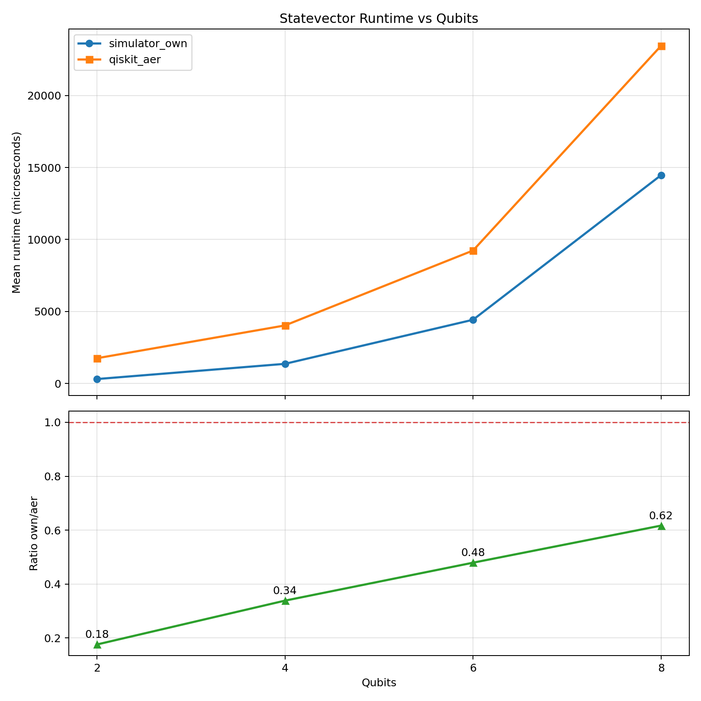

Benchmarking
============

This guide documents the benchmark cases used to compare FP-QGPU's custom simulator
against Qiskit Aer for final statevector computation.

Benchmark Cases
---------------

The benchmark test is defined in ``testing/test_benchmark_statevector.py``.
It runs the same workflow for the following qubit counts:

* 2
* 4
* 6
* 8

For each case:

* Circuit depth is set to ``max(8, num_qubits * 3)``.
* A random circuit is generated with ``seed=200 + num_qubits``.
* The custom simulator and Aer statevector backend are both timed.
* Runtime ratio is computed as ``own/aer``.

Timing and Ratio Definitions
----------------------------

For each qubit case, the benchmark stores:

* ``mean_own_s``: mean runtime of ``simulator_own`` in seconds
* ``mean_aer_s``: mean runtime of Aer statevector execution in seconds
* ``mean_ratio_own_div_aer``: ratio ``mean_own_s / mean_aer_s``

Interpretation:

* Ratio ``< 1`` means FP-QGPU is faster than Aer for that case.
* Ratio ``> 1`` means Aer is faster.

Run the Benchmark
-----------------

From the repository root:

.. code-block:: bash

   c:/GitHub/FP-QGPU/.venv/Scripts/python.exe -m pytest testing/test_benchmark_statevector.py -s

This command also generates a plot image automatically.

Generated Plot
--------------

The benchmark writes:

* ``testing/.benchmarks/statevector_runtime_vs_qubits.png``

The docs use a reusable benchmark asset:

* ``docs/_static/benchmark_runtime_vs_qubits.png``

The figure contains two subplots:

* Runtime over qubits (custom simulator vs Aer)
* Ratio over qubits (``own/aer``) with a reference line at ``1.0``

The generated plot included in the docs:

