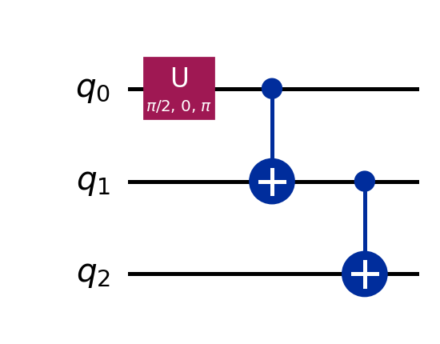

How to generate circuit plots for docs
======================================

FP-QGPU documentation includes circuit diagrams under ``docs/_static/``.

Use the plotting notebook
-------------------------

Open and run:

- ``examples/circuit_plots.ipynb``

The notebook exports:

- ``docs/_static/circuit_simple00.png``
- ``docs/_static/circuit_simple01.png``
- ``docs/_static/circuit_ghz3.png``

Rendered circuit figures
------------------------

.. figure:: _static/circuit_simple00.png
   :alt: Qiskit circuit plot for simple00
   :width: 100%

   ``simple00()`` as rendered by Qiskit.

   ``simple01()`` as rendered by Qiskit.

   ``ghz_test(3)`` as rendered by Qiskit.
