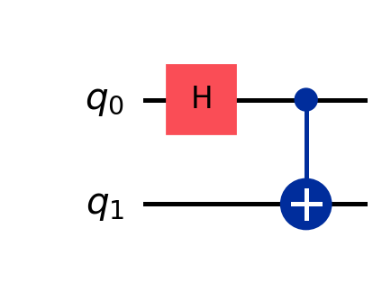

Tutorial: first simulation workflow
===================================

This tutorial walks through a complete first run: building a circuit, running
the Aer reference simulator, and then running the custom simulator.

Step 1: import the core functions
---------------------------------

.. code-block:: python

   from fp_qgpu import simple00, simulator_mock, simulator_own
   from qiskit import transpile

Step 2: run the reference simulator
-----------------------------------

.. code-block:: python

   qc = simple00()
   qc.measure_all()
   counts, statevector = simulator_mock(qc, shots=1024, seed=42)
   counts

Step 3: run the custom simulator
--------------------------------

.. code-block:: python

   qc = simple00()
   qc_transpiled = transpile(qc, basis_gates=["u", "cx"])
   psi = simulator_own(qc_transpiled)
   psi

Step 4: inspect the circuits
----------------------------

   ``simple00()`` Bell-state circuit used in this tutorial.

Next steps
----------

- Continue with :doc:`howto_run_notebooks` to execute notebook-based examples.
- Use :doc:`api_reference` when you need exact API details.
